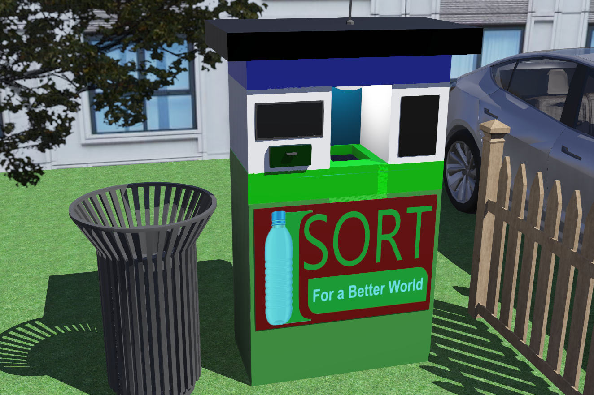
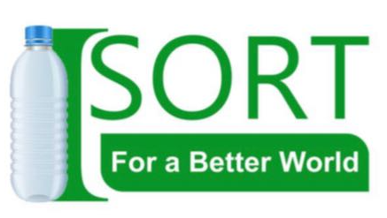

# iSORT - Plastic Sorting and Shredding Machine

This is a project we completed during our undergraduate studies (2021).

We won second place in the **Undergraduate Innovator of the Year organized by the IESL, Sri Lanka**, for this project.

This repository contains the codes for the waste classification deep learning model.

